#  Generación de Reportes con R Markdown.

M.C Erick Cuevas Fernández y Dra. Joselyn Chávez

01 de agosto de 2022

<style>

div.color { 
border-radius: 5px; 
padding: 20px;
margin: 30px 0px 30px;}

div.red { background-color:#f67155; }

div.orange{ background-color:#f0BB51;}

div.pair { 	
display: flex;
flex-direction: row;
justify-content: center;
text-align:center;
padding:0px}

div.inside { width: 49%; padding: 0px}

div.scroll { 
max-height: 400px; 
overflow-y: auto; 
background: #111111;
border-radius:5px;
padding: 10px;
margin: 30px 0px 30px;
color: #999999;}

div.alert{color:#bd475d; background-color:transparent}
</style>

## Introducción a R Markdown

**Este documento se basa en:** 

- [Advanced R Markdown Workshop rstudio::conf 2019](https://arm.rbind.io)
- [R Markdown Cookbook](https://bookdown.org/yihui/rmarkdown-cookbook/)

### Diapositivas

[
```{r,echo=FALSE}

knitr::include_url("https://erickcufe.github.io/abc_RMarkdown/abc_RMarkdown_slides.html", height = "380px")

```
](https://erickcufe.github.io/abc_RMarkdown/abc_RMarkdown_slides.html)

Puedes encontrar las diapositivas [aquí](https://erickcufe.github.io/abc_RMarkdown/abc_RMarkdown_slides.html).

### ¿Qué es y para que sirve R Markdown?

RMarkdown facilita armar un marco de autoría para ciencia de datos. Facilita la reproducibilidad del código, al permitir generar texto y código en conjunto. Tiene la bondad de soportar multiples formatos para guardar y ejecutar código, asi como para generar informes de alta calidad que se pueden compartir. 

Su estructura básica consta de:

1. **YAML**, nos permite diseñar la configuración de nuestro archivo markdown. YAML es un lenguaje de serialización de datos. Cuenta con funciones de Perl, C, XML, HTML. Se basa en el formato JSON. 

2. **Markdown**, aquí escribiremos el texto y el código que vamos a compartir en el reporte, se pueden añadir graficos, tablas, imagenes, etc. 

Básicamente esta es la estructura básica de un RMarkdown:

**YAML**
```yaml
---
title: "Bienvenido CDSB 2022"
author: "EMB 2022"
date: "2022-08-01"
output: html_document
---
```

**Markdown**
````markdown
Parrafo de R Markdown.

Esto es un fragmento de código o "chunk":

```{r}
fit = lm(dist ~ speed, data = cars)
b   = coef(fit)
plot(cars)
abline(fit)
```

La pendiente de la regresión es `r b[1]`.
````
    

### Ejemplos de uso

Entre las cosas que se pueden hacer con RMarkdown es lo siguiente:

### Agregar en un informe la información de una localización

```{r out.width='100%', fig.height=6, eval=require('leaflet')}
library(leaflet)
leaflet() %>% addTiles() %>% setView(lat = 18.95, lng = -99.239, zoom = 13)
```


### Poner la chicharronera (Fórmula cuadrática en un texto)

Esto es la chicharronera dentro de un texto $$x = \frac {-b \pm \sqrt {b^2 - 4ac}}{2a}$$

Y puedo seguir describiendo lo que siga haciendo.

$$\text{La Fórmula Cuadrática es }x = \frac {-b \pm \sqrt {b^2 - 4ac}}{2a}$$

- [RPubs](https://rpubs.com)
- [Generar correos personalizados](https://rmarkdown.rstudio.com/articles_mail_merge.html)
- [Escribir artículos](https://elifesciences.org/labs/cad57bcf/composing-reproducible-manuscripts-using-r-markdown)
  - [rticles](https://github.com/rstudio/rticles)
- [Escribir Libros](https://bookdown.org/)
  - [Escribir tesis](https://eddjberry.netlify.com/post/writing-your-thesis-with-bookdown/)
- [Crear sitios web](https://github.com/seankross/postcards)

### Crear un archivo `.Rmd`

`File` > `New_file` > `R Markdown...`

### Ejemplos

Los ejemplos de sintaxis los puedes ver a detalle en las diapositivas. 

## Creación de presentaciones y libros con R Markdown

### Diapositivas

[
```{r, echo=FALSE}
knitr::include_url("https://comunidadbioinfo.github.io/cdsb2022/dia1_sesion3.html", height = "380px")
```
](https://comunidadbioinfo.github.io/cdsb2022/dia1_sesion3.html)


Basado en 

- ["R Markdown: The Definitive Guide"](https://bookdown.org/yihui/rmarkdown/)

- ["bookdown: Authoring Books and Technical Documents with R Markdown"](https://bookdown.org/yihui/bookdown)


### El paquete xaringan

**Instalación:**

```{r,eval=FALSE}
install.packages("xaringan")
```

Creación de una nueva presentación:

File > New file > R Markdown > From Template > Ninja Presentation


### Previsualización de las diapositivas

```{r, eval=FALSE}
infinite_moon_reader()

xaringan::inf_mr()
```

```{r, echo=FALSE, out.width='60%', fig.align='center'}
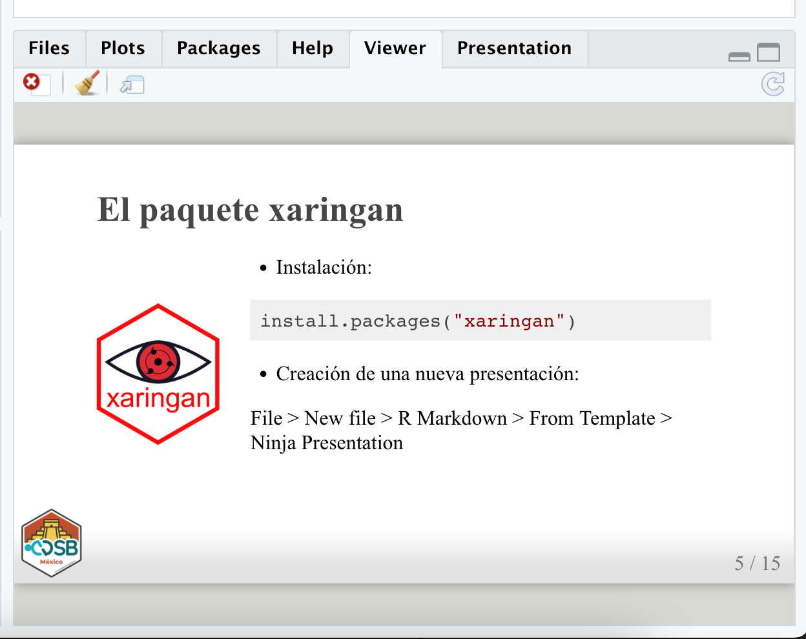
```

### La diapositiva de título

```{r, echo=FALSE, out.width='50%', fig.align='center'}
knitr::include_graphics("img/title_slide.png")
```

Modificando la diapositiva de título

```{r, echo=FALSE, out.width='50%', fig.align='center'}
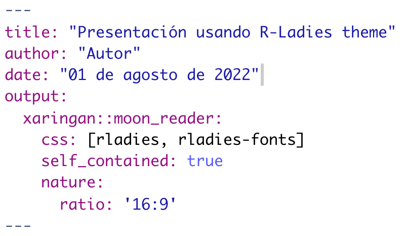
```

```{r, echo=FALSE, out.width='50%', fig.align='center'}
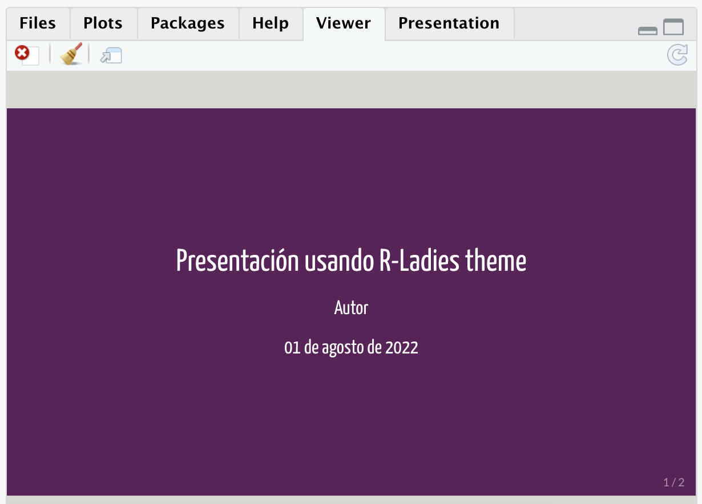
```

Otros temas: chocolate, duke, fc, hygge, ki, lucy, metropolis, middlebury, nhsr, robot, uio, useR, uwm, wic.


### Diapositivas de contenido

```{r, echo=FALSE, out.width='50%', fig.align='center'}
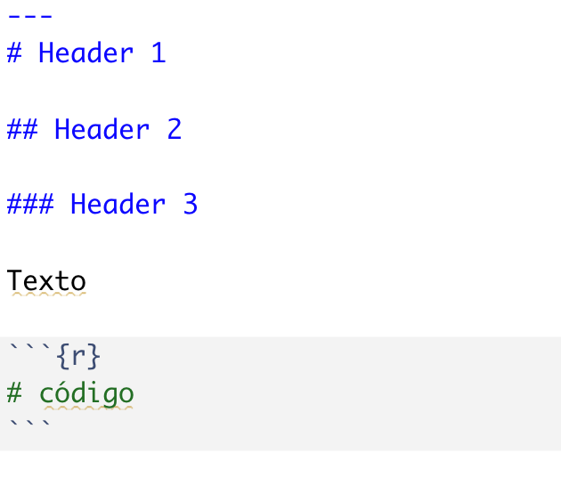
```

Ejecutando código

```{r,echo=FALSE, out.width='50%', fig.align='center'}
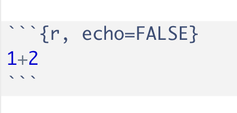
```


```{r,echo=FALSE, out.width='50%', fig.align='center'}
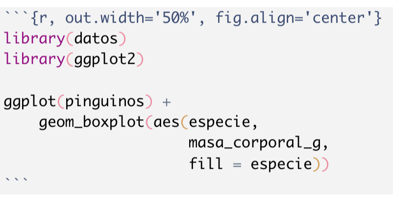
```


### Incluyendo imágenes

```{r,echo=FALSE, out.width='80%', fig.align='center'}
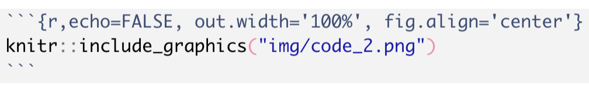
```

- El tamaño de la imagen se puede modificar usando las opciones out.width, out.height, fig.width, fig.height. 

- Las dimensiones se indican como porcentaje o como número de pixeles.


### Alineación del contenido

- Afectando todo el contenido de la diapositiva

```{r, eval=FALSE}
class: center
class: middle
```

- Afectando contenido específico

```{r, eval=FALSE}
.center[]
.pull-left[]
.pull-right[]
```


### Compartiendo la presentación

**Como página web**

Generar el archivo html usando Knit > Publicar usando **GitHub pages**

```{r, echo=FALSE, out.width='50%', fig.align='center'}
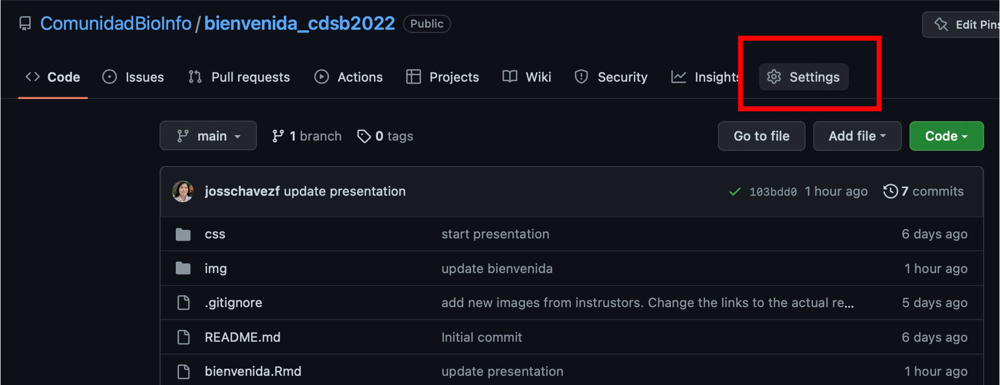
```

```{r, echo=FALSE, out.width='50%', fig.align='center'}
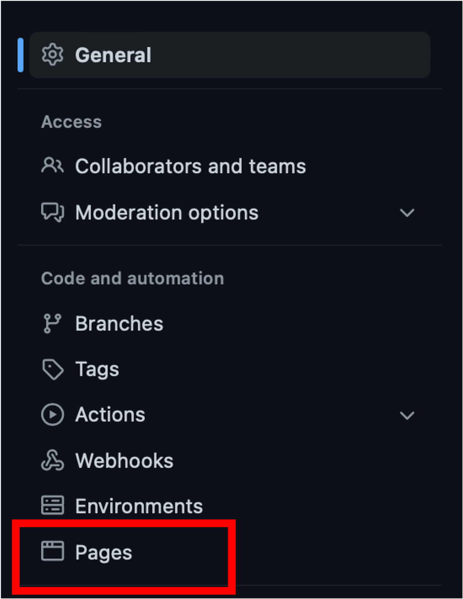
```


```{r, echo=FALSE, out.width='50%', fig.align='center'}
knitr::include_graphics("img/settings_3.png")
```


**Como pdf**

Generar el archivo html usando Knit > Convertir a pdf usando **pagedown**

```{r, eval=FALSE}
pagedown::chrome_print("presentacion.html")
```

Nota: Es necesario mantener el ratio original de las diapositivas.


### Información adicional

https://bookdown.org/yihui/rmarkdown/xaringan.html

```{r, echo=FALSE, out.width='80%', fig.align='center'}
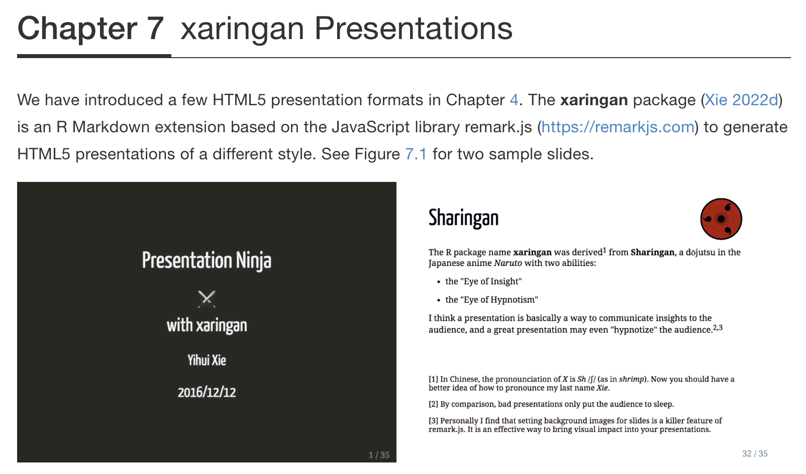
```


### Creación de libros con bookdown

**Instalación:**

```{r,eval=FALSE}
install.packages("bookdown")
```

Descarga alguno de los ejemplos:

- https://github.com/yihui/bookdown-minimal

- https://github.com/rstudio/bookdown-demo


### Templado a utilizar

https://github.com/ComunidadBioInfo/templado_bookdown/

```{r, echo=FALSE, out.width='80%', fig.align='center'}
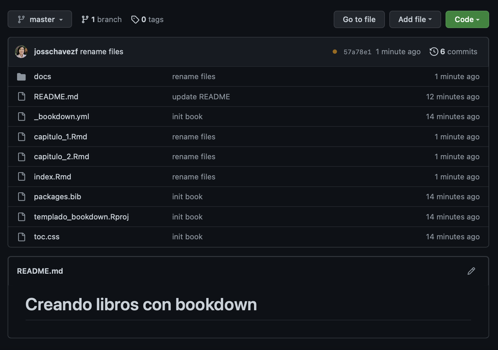
```

### Agregando contenido

- Cada archivo Rmd representa un capítulo
- Los capítulos van ordenados/numerados
- No se deben renderizar los Rmd
- Las imágenes llamadas dentro de los capítulos se colocan en img
- Para incluir las imáges se usa: knitr::include_graphics("img/imagen.png")
- Los archivos html llamados dentro de los capítulos se colocan en docs 

### Publicando el libro

Renderizado > Publicación con GitHub pages

```{r, eval=FALSE}
bookdown::render_book()
```

Los html correspondientes a los capítulos se renderizan de manera automática en **docs**

El libro quedará disponible en https://comunidadbioinfo.github.io/templado_bookdown/


### Configuración del repositorio

```{r, echo=FALSE, out.width='50%', fig.align='center'}
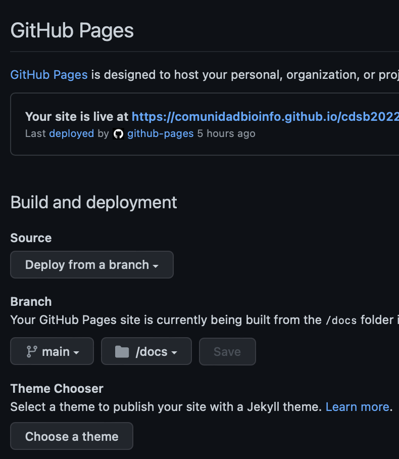
```


### Información adicional

https://bookdown.org/yihui/bookdown/

```{r, echo=FALSE, out.width='30%', fig.align='center'}
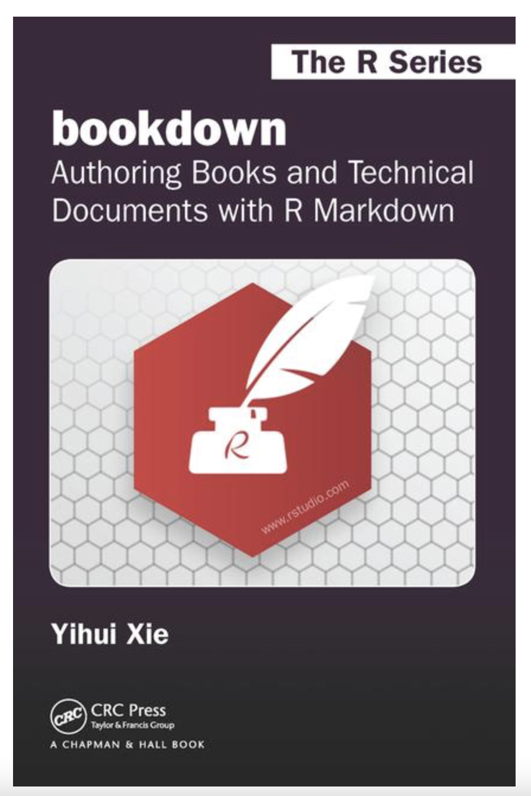
```


