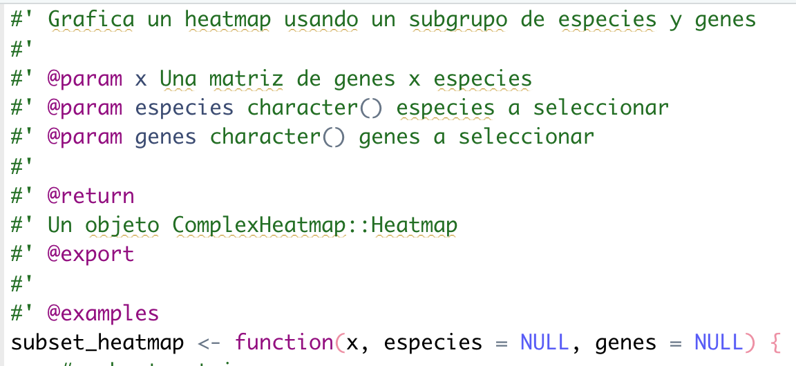

# Un vistazo a la creación de paquetes de R/Bioconductor

Dra. Joselyn Chávez

04 de agosto de 2022

<style>
div.grey { 
background-color: #bfbfbf;
}
</style>

<style>
div.center {
text-align:center;
}
</style>

## Diapositivas

[
```{r, echo=FALSE}
knitr::include_url("https://comunidadbioinfo.github.io/cdsb2022/dia4_sesion1.html", height = "380px")
```
](https://comunidadbioinfo.github.io/cdsb2022/dia4_sesion1.html)


Material basado en 
- ["R packages" by Hadley Wickham](https://r-pkgs.org)

- ["Building Tidy Tools" by Charlotte and Hadley Wickham](https://github.com/hadley/tidy-tools)

## Recapitulemos

- Revisar si podemos usar el nombre del paquete

```{r, eval=FALSE}
available::available("pkgMetagenomica")
```

- Crear la estructura inicial del paquete

```{r, eval=FALSE}
usethis::create_package("pkgMetagenomica")
```

- Podemos agregar la estructura de biocthis

```{r, eval=FALSE}
biocthis::use_bioc_pkg_templates()
```

- Pedir que Git ignore el archivo .Rproj

```{r, eval=FALSE}
usethis::use_git_ignore("*.Rproj")
```

- Crear el respositorio de GitHub

```{r, eval=FALSE}
usethis::use_github()
```

- Crear el archivo Description estilo Bioconductor

```{r, eval=FALSE}
biocthis::use_bioc_description()
```

- Crear el archivo README estilo Bioconductor

```{r, eval=FALSE}
biocthis::use_bioc_readme_rmd()
devtools::build_readme()
```

Recuerda guardar los cambios, hacer commit y push

- Crear el archivo NEWS estilo Bioconductor

```{r, eval=FALSE}
biocthis::use_bioc_news_md()
```

- Crear ayuda para usuarios y contribuidores

```{r, eval=FALSE}
biocthis::use_bioc_coc()
usethis::use_tidy_contributing()
biocthis::use_bioc_support()
biocthis::use_bioc_issue_template()
biocthis::use_bioc_citation()
```


## Buenas prácticas para escribir funciones

Características del nombre de la función:

- Cortos pero descriptivos
- Recomendable: Separar las palabras con _
- Establecer una palabra en común al inicio para familias de funciones

```{r, eval=FALSE}
use_bioc_citation() # es mejor que

citation()
bioc_cit()
usebioccitation()
useBiocCitation()
use.bioc.citation()
```

Estructura recomendada de la función:

- Indentar las líneas de código
- Agregar comentarios para separar/describir las secciones importantes
- Usar la sintaxis paquete::funcion() cuando hacemos llamado a funciones de otros paquetes

### Ejercicio

```{r, eval=FALSE}
usethis::use_r("subset_heatmap")
```

Generemos el código de manera regular

Simulemos una matriz con niveles de expresión de genes y grafiquemos los datos en un heatmap

```{r, eval=FALSE}
expresion_genes <- matrix(rnorm(100), nrow = 10)
rownames(expresion_genes) <- paste0("gene_",letters[1:10])
colnames(expresion_genes) <- paste0("especie_",letters[1:10])

library(ComplexHeatmap)

Heatmap(expresion_genes,
        cluster_columns = FALSE,
        heatmap_legend_param = list(title = "log2"))
```

Escribamos una función que permita seleccionar algunas especies/genes de interés y genere el heatmap.

```{r, eval=FALSE}
library(ComplexHeatmap)
subset_heatmap <- function(x,especies=NULL,genes=NULL) {
x_subset <- x[genes,especies]
Heatmap(expresion_genes,
cluster_columns=FALSE,
heatmap_legend_param=list(title="log2"))
}
```

Esta no es la mejor opción

Un poco mejor:

```{r, eval=FALSE}
library(ComplexHeatmap)
subset_heatmap <- function(x, especies = NULL, genes = NULL) {
    x_subset <- x[genes,especies]
    Heatmap(expresion_genes,
            cluster_columns = FALSE,
            heatmap_legend_param = list(title = "log2"))
}
```

Mucho mejor:

```{r, eval=FALSE}
subset_heatmap <- function(x, especies = NULL, genes = NULL) {
    # subset matrix
    x_subset <- x[genes,especies]
    
    # plot heatmap
    ComplexHeatmap::Heatmap(x_subset,
                            cluster_columns = FALSE,
                            heatmap_legend_param = list(title = "log2"))
}

subset_heatmap(expresion_genes,
               especies = c("especie_a", "especie_b","especie_c"),
               genes = c("gene_d","gene_e","gene_f"))
```


### Actividad

<div class = "orange color">

Escribe una función que: 
- Filtre la matriz de expresión y mantenga sólo los valores por encima de cierto valor.
- Genere el heatmap filtrado

Recuerda seguir las recomendaciones para escribir funciones.

</div>

## Documentación

- Descripción de los argumentos/parámetros
- Ejemplos reproducibles

Usaremos el paquete roxygen2

- Coloca el cursor dentro de la función.
- Usa la varita mágica para crear el esqueleto de documentación de roxygen.

```{r, echo=FALSE, out.width='40%', fig.align='center'}
knitr::include_graphics("img/roxygen.png")
```

Llena los campos de la documentación:

- Para cada argumento/parámetro se debe agregar la descripción, por ejemplo el tipo de objeto que esperas que el usuario introduzca.
- Describe lo que hace tu función.
- Indica qué tipo de salida tendrá la función.

```{r, echo=FALSE, out.width='50%', fig.align='center'}

```

Agrega un ejemplo sencillo y reproducible

```{r, echo=FALSE, out.width='50%', fig.align='center'}
knitr::include_graphics("img/roxygen_example.png")
```

Una vez que terminamos de escribir la documentación, generamos el archivo de ayuda

```{r, eval=FALSE}
devtools::document()
```

Construye el paquete, después reinicia la sesión y carga tu paquete. 

```{r, eval=FALSE}
devtools::build()
```

Esto nos permitirá consultar la ayuda de la función usando

```{r, eval=FALSE}
help(subset_heatmap)
?subset_heatmap
```

### Actividad

<div class = "orange color">

- Genera la documentación de la función que creaste para filtrar la matriz y graficar un heatmap.

- Comprueba que se pueda consultar la ayuda de tu función.

</div>

## Archivos de prueba

¿Para qué nos sirven los archivos de prueba?

- Estar seguros que la función tiene el comportamiento deseado
- Verificar que la función es capaz de detectar las entradas correctas y reaccionar ante las entradas incorrectas.
- Verificar que la salida de la función es la esperada.
- Detectar fácilmente cuando una actualización interna o externa rompe nuestro código.

Vamos a utilizar la función subset_heatmap

Ahora hagamos el archivo de pruebas:

```{r, eval=FALSE}
usethis::use_testthat()
usethis::use_test("subset_heatmap")
usethis::use_coverage()
```

Pensemos en formas de romper nuestra función:

- ¿Qué pasa si le damos como entrada un data frame?
- ¿Qué pasa si solamente le damos como entrada los genes y no las especies?  
- ¿Qué pasa si el vector de especies o genes es numérico en lugar de caracter?

Escribamos algunas pruebas:

```{r, eval=FALSE}
expresion_genes <- matrix(rnorm(100), nrow = 10)
rownames(expresion_genes) <- paste0("gene_",letters[1:10])
colnames(expresion_genes) <- paste0("especie_",letters[1:10])

test_that("Output is a ComplexHeatmap", {
    resultado <- subset_heatmap(expresion_genes,
                                especies = c("especie_a", "especie_b","especie_c"),
                                genes = c("gene_d","gene_e","gene_f"))
    expect_s4_class(resultado, "Heatmap")
})
```

Evalúa la prueba usando: 

```{r, eval=FALSE}
testthat::test_file("tests/testthat/test-subset_heatmap.R")
```


Siguiente prueba:

```{r, eval=FALSE}
test_that("Empty argument genes are detected",{
    expect_error(subset_heatmap(expresion_gene,
                 especies = c("especie_a", "especie_b","especie_c")) )
})
```

Una más:

```{r, eval=FALSE}
test_that("Error with data frame works",{
    expect_error(subset_heatmap(as.data.frame(expresion_genes)) )
})
```

Modifiquemos la función para poder detectar errores:

```{r, eval=FALSE}
subset_heatmap <- function(x, especies = NULL, genes = NULL) {
    # evalate class of x
    stopifnot("x must be a matrix" = inherits(x, "matrix"))

    # subset matrix
    x_subset <- x[genes,especies]

    # plot heatmap
    ComplexHeatmap::Heatmap(x_subset,
                            cluster_columns = FALSE,
                            heatmap_legend_param = list(title = "log2"))
}
```

Vuelve a correr el test:

```{r, eval=FALSE}
testthat::test_file("tests/testthat/test-subset_heatmap.R")
```


## Crear una vignette

- Debe mostrar un flujo de análisis explotando el potencial de tu paquete.
- Implementa tantas funciones de tu paquete como sea posible, pero no es necesari que incluya todas.
- Los datos a usar deben ser pequeños o fáciles de acceder. 
- Puedes crear múltiples viñetas para mostrar diferentes casos de análisis y cubrir una mayor cantidad de funciones.

```{r, eval=FALSE}
biocthis::use_bioc_vignette("Introduccion_a_pkgMetagenomica")
```

## Creado paquetes de forma colaborativa

Agrega colaboradores a tu repositorio

- Ve al repositorio de tu paquete

- Entra a settings > collaborators > Add people

- Agrega el nombre de usuario de tu colaborador.

- Tu colaborador debe aceptar la invitación que le llegará por correo electrónico.

```{r, echo=FALSE, out.width='50%', fig.align='center'}

```

### Actividad

<div class = "orange color">

- Agrega un colaborador al repositorio de tu paquete.

- Pídele que agregue un archivo de pruebas/test para la función que creaste (filtra la matriz con valores mayores al que provee el usuario).

- Verifica que los cambios se ven reflejados en tu repositorio.

- Cambien de rol y agrega una nueva función al repositorio de tu colega.

</div>
